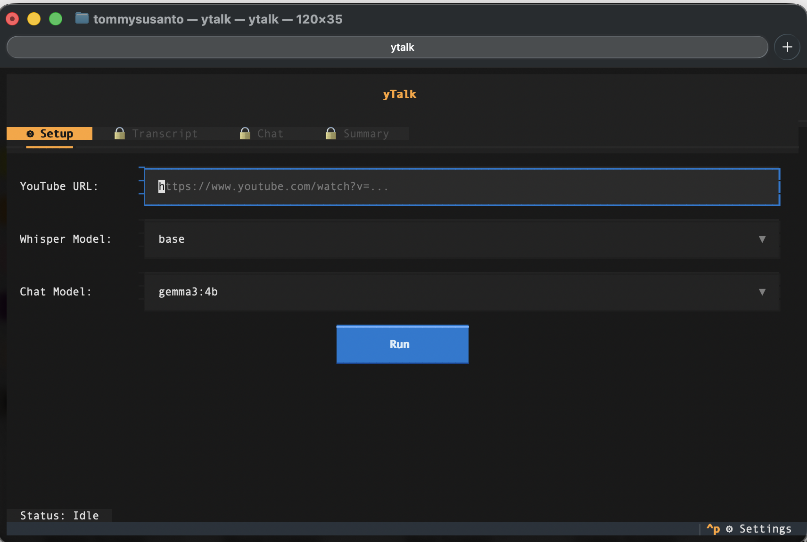
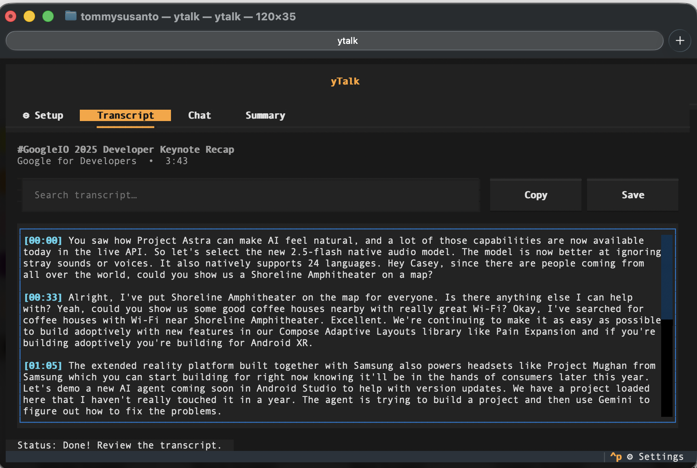
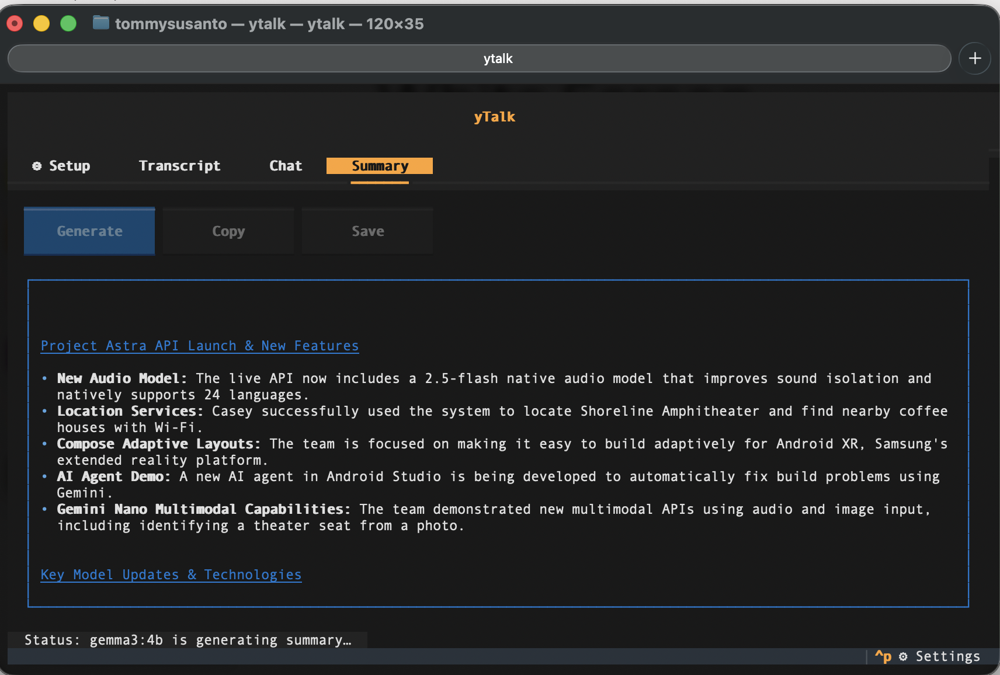
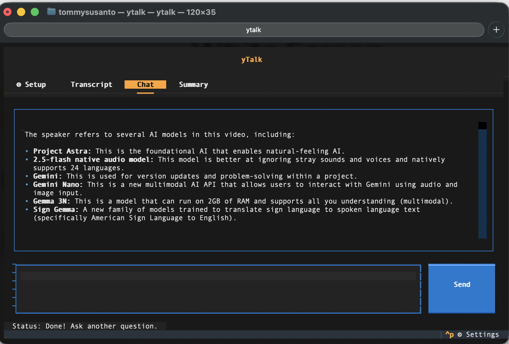

<div align="center">

# yTalk

**Download a YouTube video, transcribe it with Whisper, and chat about it using Ollama — all from your terminal.**

[](https://www.python.org/downloads/)
[](LICENSE)
[](https://github.com/openai/whisper)
[](https://ollama.ai)

</div>

---

<table>
  <tr>
    <td align="center"><br/><sub>Paste a YouTube URL and pick models</sub></td>
    <td align="center"><br/><sub>Whisper transcribes locally</sub></td>
  </tr>
  <tr>
    <td align="center"><br/><sub>One-click summary via Ollama</sub></td>
    <td align="center"><br/><sub>Chat about the video</sub></td>
  </tr>
</table>

## What it does

1. **Downloads** audio from any YouTube video (via yt-dlp)
2. **Transcribes** the audio locally using OpenAI Whisper
3. **Lets you chat** about the video content with a local LLM through Ollama

Everything runs locally on your machine. No API keys, no cloud services, no data leaves your computer.

## Features

- Interactive TUI with real-time progress indicators
- Headless CLI mode for scripting and automation
- Multiple Whisper model sizes (tiny, base, small, large)
- Auto-detects available Ollama models
- One-click summarization of transcripts
- One-click YouTube chapter timestamps, ready to paste into a comment
- Multi-turn chat with full conversation history
- Save transcripts and summaries to file

## Install

```bash
brew install tommysusanto/tap/ytalk
```

This pulls in Python, ffmpeg, and Ollama as dependencies automatically.

Then start Ollama and pull a chat model:

```bash
brew services start ollama
ollama pull gemma3:4b
```

### Choosing a chat model

Ollama runs models entirely in memory, so the model has to fit the machine. On Apple
Silicon the GPU can use roughly 75% of system RAM, and a model needs about its download
size (`ollama list`) for weights, plus a context window on top of that.

A good rule of thumb is to pick a model whose download size is under half your RAM. On a
24 GB Mac, `gemma3:4b` (3.3 GB) and `gemma4:e4b` (9.6 GB) are comfortable; a 30B model
(~18 GB) is not.

yTalk sizes the context window to the transcript, but caps it at what still fits beside
the model's weights. If the model you picked is too big for the machine, the status bar
says so, the window falls back to 4096 tokens, and long transcripts are trimmed to fit —
summary and chat still work, they just see less of the video. A smaller model that fits
will give better answers than a larger one that doesn't.

This cap is worth having: GPU memory on Apple Silicon is wired and cannot be swapped out,
so a model that overshoots the budget pushes the rest of the system into swap and can lock
the machine up rather than failing cleanly.

### Upgrading

```bash
brew trust tommysusanto/tap   # one-time on Homebrew 5.1.15+ (see below)
brew update                   # fetch the latest formula from the tap
brew upgrade ytalk
```

`brew update` is required, not optional: `brew upgrade` compares against the
formula already cached on disk and never fetches new tap commits on its own. Skip
it and brew reports `tommysusanto/tap/ytalk X.Y.Z already installed` even when a
newer release exists. `brew update` pulls the new formula; then `brew upgrade`
sees it and installs it.

### Homebrew tap trust (5.1.15+)

As of [Homebrew 5.1.15](https://github.com/Homebrew/brew/releases/tag/5.1.15) (June 2026), Homebrew no longer loads a third-party tap's formulae until you explicitly trust the tap — a new [tap-trust security feature](https://github.com/Homebrew/brew/pull/22470). Once Homebrew updates itself to 5.1.15+ you may see:

```
Error: Refusing to load formula tommysusanto/tap/ytalk from untrusted tap.
```

This is a Homebrew change, not specific to yTalk. What to do:

- **Fresh install** — `brew install tommysusanto/tap/ytalk` keeps working as-is; a fully-qualified formula name is exempt from the check.
- **Upgrades** — `brew upgrade ytalk`, `brew outdated`, and bare `brew upgrade` load the tap, so trust it once:

  ```bash
  brew trust tommysusanto/tap
  ```

  Or trust only this formula: `brew trust --formula tommysusanto/tap/ytalk`.

- **Opt out during the transition** (not recommended; the flag is temporary): `export HOMEBREW_NO_REQUIRE_TAP_TRUST=1`.

Explicit trust becomes the default in Homebrew 5.2.0 / 6.0.0. Details: [docs.brew.sh/Tap-Trust](https://docs.brew.sh/Tap-Trust).

### Install from source

For development or if you prefer not to use Homebrew:

```bash
git clone https://github.com/tommysusanto/ytalk.git
cd ytalk
pip install -e .
```

Requires Python 3.11+, ffmpeg, and Ollama installed separately.

## Usage

### TUI Mode

Launch the interactive interface:

```bash
ytalk
```

1. Paste a YouTube URL
2. Pick a Whisper model size and chat model
3. Click **Run** — watch it download, transcribe, then chat

### CLI Mode

Process a video directly from the command line:

```bash
ytalk https://youtube.com/watch?v=dQw4w9WgXcQ
```

With options:

```bash
ytalk https://youtube.com/watch?v=dQw4w9WgXcQ \
  --whisper-model small \
  --ollama-model gemma3:4b \
  -o output.txt
```

| Flag | Default | Description |
|------|---------|-------------|
| `--whisper-model` | `base` | Whisper model size: `tiny`, `base`, `small`, `large` |
| `--ollama-model` | `gemma3:4b` | Ollama model for summarization |
| `-o`, `--output` | — | Save transcript + summary to file |

## How it works

```
YouTube URL
    │
    ▼
┌─────────┐     ┌───────────┐     ┌─────────┐
│  yt-dlp  │────▶│  Whisper   │────▶│  Ollama  │
│ download │     │ transcribe │     │   chat   │
└─────────┘     └───────────┘     └─────────┘
    audio            text           conversation
```

## Project Structure

```
ytalk/
├── src/ytalk/
│   ├── __init__.py      # Package version
│   └── app.py           # TUI app, CLI, and pipeline logic
├── tests/
│   ├── test_ctx_for.py  # Context sizing and memory-cap unit tests
│   └── test_tui.py      # Headless TUI integration test
├── Formula/
│   └── ytalk.rb         # Homebrew formula (template)
└── pyproject.toml       # Build config and dependencies
```

## Development

Changes to `src/ytalk/` take effect immediately (editable install). No need to reinstall.

Run the tests:

```bash
python tests/test_ctx_for.py   # unit tests; offline, no Ollama needed
python tests/test_tui.py       # integration test; downloads a real video
```

## License

MIT
